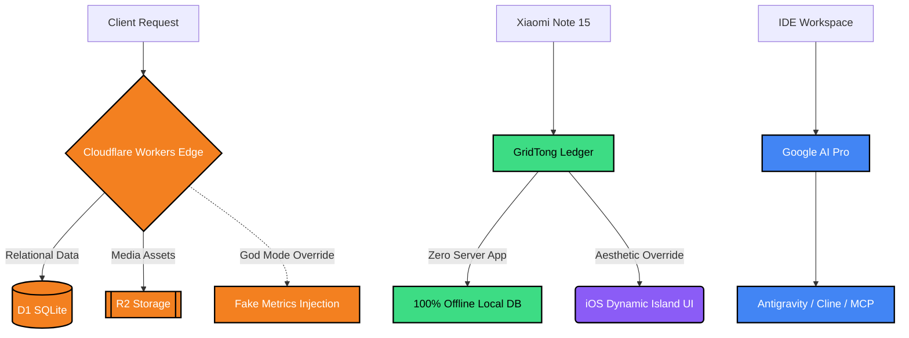

  

  

  
  
  
  

 

<h3 align="center">📐 SYSTEM ARCHITECTURE TOPOLOGY</h3>

  

 

<h3 align="center">🚀 A.T. FIELD DEPLOYMENTS</h3>

<table align="center" width="100%" style="background-color: #0d1117; border-radius: 15px; border: 1px solid #30363d;">
  <tr>
    <td width="15%" align="center" valign="middle">
      
    </td>
    <td width="85%" style="padding: 15px;">
      <h3 style="margin: 0; color: #F38020;">`my-anime-blog` Ecosystem</h3>
      

        
        
        
      

      <samp style="color: #c9d1d9; font-size: 13px;">> High-performance anime matrix. Absolute sub-atomic control over user assets. Built-in gamified economy & PV/UV metric override protocols.</samp>
    </td>
  </tr>
</table>

<table align="center" width="100%" style="background-color: #0d1117; border-radius: 15px; border: 1px solid #30363d;">
  <tr>
    <td width="15%" align="center" valign="middle">
      
    </td>
    <td width="85%" style="padding: 15px;">
      <h3 style="margin: 0; color: #3DDC84;">GridTong Local Ledger</h3>
      

        
        
        
      

      <samp style="color: #c9d1d9; font-size: 13px;">> Zero-latency Android ledger. Rejected native UI for absolute Apple iOS frosted-glass aesthetics. Background-free, high-def minimalism.</samp>
    </td>
  </tr>
</table>

<table align="center" width="100%" style="background-color: #0d1117; border-radius: 15px; border: 1px solid #30363d;">
  <tr>
    <td width="15%" align="center" valign="middle">
      
    </td>
    <td width="85%" style="padding: 15px;">
      <h3 style="margin: 0; color: #8B5CF6;">Web3D Hacking Sandbox</h3>
      

        
        
        
      

      <samp style="color: #c9d1d9; font-size: 13px;">> Story-driven hacking simulator. Pushing browser canvas limits with intense atmospheric 3D environments and deep logic interactions.</samp>
    </td>
  </tr>
</table>

 

<h3 align="center">🧬 ABSOLUTE SKILL MATRIX</h3>

<table align="center" width="100%" style="border-collapse: collapse;">
  <tr>
    <td width="50%" align="center" style="background-color: #0d1117; border: 1px solid #30363d; border-radius: 10px; padding: 15px;">
      <b>[ FRONTEND & WEB3D ]</b>  
      
    </td>
    <td width="50%" align="center" style="background-color: #0d1117; border: 1px solid #30363d; border-radius: 10px; padding: 15px;">
      <b>[ EDGE & DATABASE ]</b>  
      
    </td>
  </tr>
  <tr>
    <td width="50%" align="center" style="background-color: #0d1117; border: 1px solid #30363d; border-radius: 10px; padding: 15px;">
      <b>[ MOBILE & UI/UX ]</b>  
      
    </td>
    <td width="50%" align="center" style="background-color: #0d1117; border: 1px solid #30363d; border-radius: 10px; padding: 15px;">
      <b>[ DEVOPS & SYSTEM ]</b>  
      
    </td>
  </tr>
</table>

 

<h3 align="center">🛡️ SYSTEM ANALYTICS</h3>

  

  
  

  

<h3 align="center">🌌 DYNAMIC CODE CONSTELLATIONS</h3>

  <picture>
    
  </picture>

  <picture>
    <source media="(prefers-color-scheme: dark)" srcset="https://raw.githubusercontent.com/AincFh/AincFh/output/github-contribution-grid-snake-dark.svg">
    <source media="(prefers-color-scheme: light)" srcset="https://raw.githubusercontent.com/AincFh/AincFh/output/github-contribution-grid-snake.svg">
    
  </picture>

 

  

  
  
  

